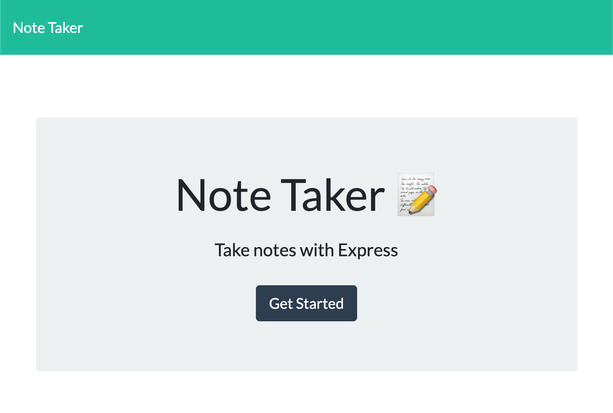
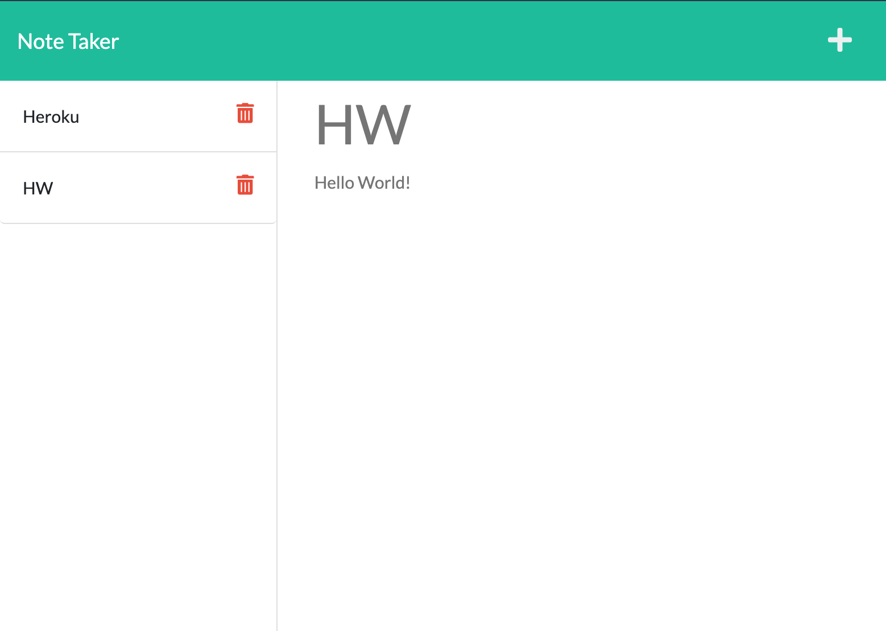

    
    
    
    
    
    

# Le Note Taker 📝

Le Note Taker is a simple note taker, deployed on [Heroku](https://www.heroku.com) that allows you to have your notes available in the cloud, in real time.

## Quirks 🎯

The app allows you to create, delete, and edit notes. All whilst being deployed on the Heroku cloud.

## Preview 👀 
[Live Heroku Site](https://le-note-taker.herokuapp.com/)

## License 📓
[MIT](https://choosealicense.com/licenses/mit/)